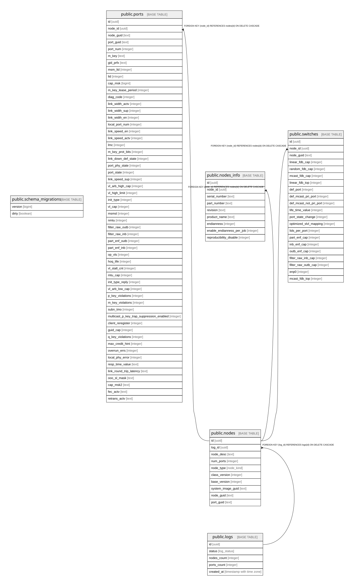

# topo

## Tables

| Name | Columns | Comment | Type |
| ---- | ------- | ------- | ---- |
| [public.schema_migrations](public.schema_migrations.md) | 2 |  | BASE TABLE |
| [public.logs](public.logs.md) | 5 | Журнал сессий парсинга файлов топологии ibdiagnet | BASE TABLE |
| [public.nodes](public.nodes.md) | 10 | Узлы топологии (коммутаторы и хосты) | BASE TABLE |
| [public.ports](public.ports.md) | 56 | Информационная сводка по всем портам InfiniBand, принадлежащим узлам | BASE TABLE |
| [public.nodes_info](public.nodes_info.md) | 9 | Агрегация дополнительных метаданных об узлах из файла .sharp_an_info | BASE TABLE |
| [public.switches](public.switches.md) | 21 | Таблица для хранения сущностей коммутаторов. Связана с nodes. | BASE TABLE |

## Stored procedures and functions

| Name | ReturnType | Arguments | Type |
| ---- | ------- | ------- | ---- |
| public.uuid_nil | uuid |  | FUNCTION |
| public.uuid_ns_dns | uuid |  | FUNCTION |
| public.uuid_ns_url | uuid |  | FUNCTION |
| public.uuid_ns_oid | uuid |  | FUNCTION |
| public.uuid_ns_x500 | uuid |  | FUNCTION |
| public.uuid_generate_v1 | uuid |  | FUNCTION |
| public.uuid_generate_v1mc | uuid |  | FUNCTION |
| public.uuid_generate_v3 | uuid | namespace uuid, name text | FUNCTION |
| public.uuid_generate_v4 | uuid |  | FUNCTION |
| public.uuid_generate_v5 | uuid | namespace uuid, name text | FUNCTION |

## Enums

| Name | Values |
| ---- | ------- |
| public.log_status | error, in_progress, pending, success |
| public.node_kind | host, switch |

## Relations

---

> Generated by [tbls](https://github.com/k1LoW/tbls)
