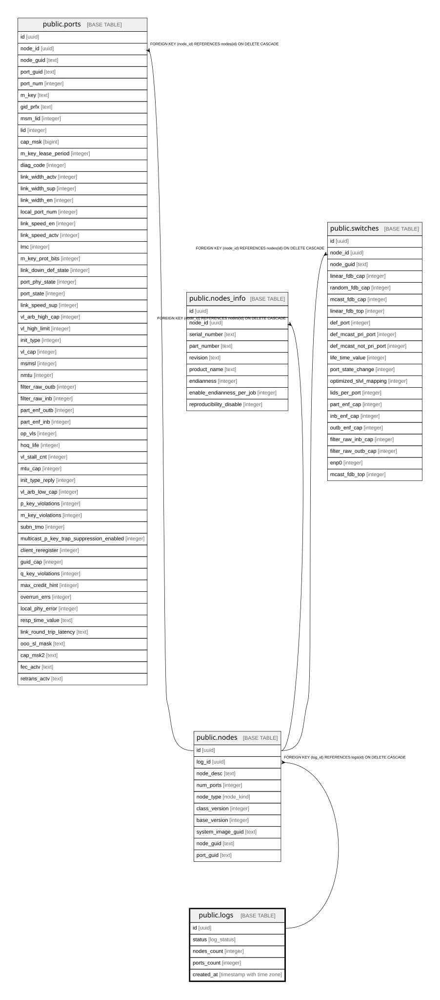

# public.logs

## Description

Журнал сессий парсинга файлов топологии ibdiagnet

## Columns

| Name | Type | Default | Nullable | Children | Parents | Comment |
| ---- | ---- | ------- | -------- | -------- | ------- | ------- |
| id | uuid | uuid_generate_v4() | false | [public.nodes](public.nodes.md) |  |  |
| status | log_status | 'pending'::log_status | false |  |  | Текущий статус обработки лога |
| nodes_count | integer | 0 | false |  |  | Агрегированное количество успешно распарсенных узлов |
| ports_count | integer | 0 | false |  |  | Агрегированное количество успешно распарсенных портов |
| created_at | timestamp with time zone | now() | false |  |  |  |

## Constraints

| Name | Type | Definition |
| ---- | ---- | ---------- |
| logs_pkey | PRIMARY KEY | PRIMARY KEY (id) |

## Indexes

| Name | Definition |
| ---- | ---------- |
| logs_pkey | CREATE UNIQUE INDEX logs_pkey ON public.logs USING btree (id) |

## Relations

---

> Generated by [tbls](https://github.com/k1LoW/tbls)
