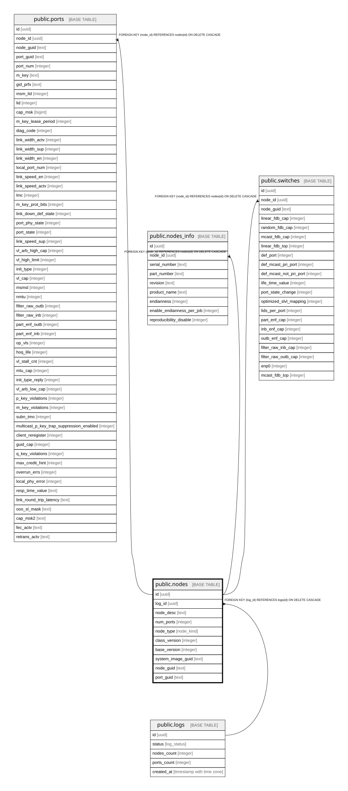

# public.nodes

## Description

Узлы топологии (коммутаторы и хосты)

## Columns

| Name | Type | Default | Nullable | Children | Parents | Comment |
| ---- | ---- | ------- | -------- | -------- | ------- | ------- |
| id | uuid |  | false | [public.ports](public.ports.md) [public.nodes_info](public.nodes_info.md) [public.switches](public.switches.md) |  |  |
| log_id | uuid |  | false |  | [public.logs](public.logs.md) |  |
| node_desc | text |  | false |  |  | Словесное описание узла (например, "SWITCH_1" или "HOST_2") |
| num_ports | integer |  | false |  |  | Количество портов, заявленное на узле |
| node_type | node_kind |  | false |  |  | Тип сетевого оборудования (host или switch) |
| class_version | integer |  | false |  |  |  |
| base_version | integer |  | false |  |  |  |
| system_image_guid | text |  | false |  |  |  |
| node_guid | text |  | false |  |  | Глобальный уникальный идентификатор узла (GUID) |
| port_guid | text |  | false |  |  |  |

## Constraints

| Name | Type | Definition |
| ---- | ---- | ---------- |
| nodes_log_id_fkey | FOREIGN KEY | FOREIGN KEY (log_id) REFERENCES logs(id) ON DELETE CASCADE |
| nodes_pkey | PRIMARY KEY | PRIMARY KEY (id) |
| nodes_log_id_node_guid_key | UNIQUE | UNIQUE (log_id, node_guid) |

## Indexes

| Name | Definition |
| ---- | ---------- |
| nodes_pkey | CREATE UNIQUE INDEX nodes_pkey ON public.nodes USING btree (id) |
| nodes_log_id_node_guid_key | CREATE UNIQUE INDEX nodes_log_id_node_guid_key ON public.nodes USING btree (log_id, node_guid) |

## Relations

---

> Generated by [tbls](https://github.com/k1LoW/tbls)
