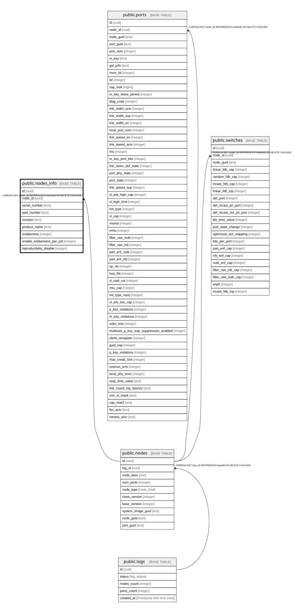

# public.nodes_info

## Description

Агрегация дополнительных метаданных об узлах из файла .sharp_an_info

## Columns

| Name | Type | Default | Nullable | Children | Parents | Comment |
| ---- | ---- | ------- | -------- | -------- | ------- | ------- |
| id | uuid | uuid_generate_v4() | false |  |  |  |
| node_id | uuid |  | false |  | [public.nodes](public.nodes.md) |  |
| serial_number | text |  | true |  |  | Серийный номер устройства |
| part_number | text |  | true |  |  |  |
| revision | text |  | true |  |  |  |
| product_name | text |  | true |  |  | Коммерческое название оборудования (например, Mellanox) |
| endianness | integer |  | true |  |  | Порядок следования байтов (обычно 0 - Little-Endian, 1 - Big-Endian) |
| enable_endianness_per_job | integer |  | true |  |  |  |
| reproducibility_disable | integer |  | true |  |  |  |

## Constraints

| Name | Type | Definition |
| ---- | ---- | ---------- |
| nodes_info_node_id_fkey | FOREIGN KEY | FOREIGN KEY (node_id) REFERENCES nodes(id) ON DELETE CASCADE |
| nodes_info_pkey | PRIMARY KEY | PRIMARY KEY (id) |
| nodes_info_node_id_key | UNIQUE | UNIQUE (node_id) |

## Indexes

| Name | Definition |
| ---- | ---------- |
| nodes_info_pkey | CREATE UNIQUE INDEX nodes_info_pkey ON public.nodes_info USING btree (id) |
| nodes_info_node_id_key | CREATE UNIQUE INDEX nodes_info_node_id_key ON public.nodes_info USING btree (node_id) |

## Relations

---

> Generated by [tbls](https://github.com/k1LoW/tbls)
