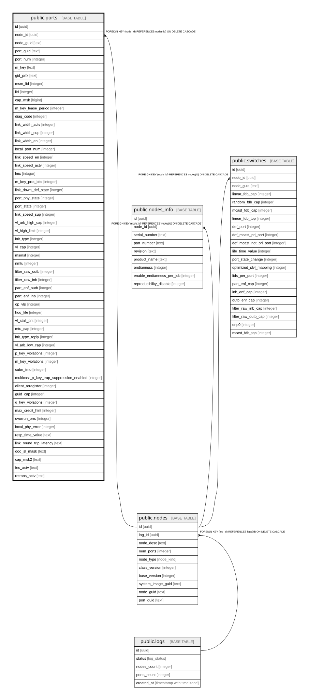

# public.ports

## Description

Информационная сводка по всем портам InfiniBand, принадлежащим узлам

## Columns

| Name | Type | Default | Nullable | Children | Parents | Comment |
| ---- | ---- | ------- | -------- | -------- | ------- | ------- |
| id | uuid | uuid_generate_v4() | false |  |  |  |
| node_id | uuid |  | false |  | [public.nodes](public.nodes.md) |  |
| node_guid | text |  | false |  |  |  |
| port_guid | text |  | false |  |  |  |
| port_num | integer |  | false |  |  | Порядковый номер порта на узле |
| m_key | text |  | false |  |  |  |
| gid_prfx | text |  | false |  |  |  |
| msm_lid | integer |  | true |  |  |  |
| lid | integer |  | true |  |  |  |
| cap_msk | bigint |  | true |  |  | Битовая маска возможностей (Capability Mask) |
| m_key_lease_period | integer |  | true |  |  |  |
| diag_code | integer |  | true |  |  |  |
| link_width_actv | integer |  | true |  |  |  |
| link_width_sup | integer |  | true |  |  |  |
| link_width_en | integer |  | true |  |  |  |
| local_port_num | integer |  | true |  |  |  |
| link_speed_en | integer |  | true |  |  |  |
| link_speed_actv | integer |  | true |  |  |  |
| lmc | integer |  | true |  |  |  |
| m_key_prot_bits | integer |  | true |  |  |  |
| link_down_def_state | integer |  | true |  |  |  |
| port_phy_state | integer |  | true |  |  |  |
| port_state | integer |  | true |  |  | Текущее логическое состояние порта (например, Active, Down) |
| link_speed_sup | integer |  | true |  |  |  |
| vl_arb_high_cap | integer |  | true |  |  |  |
| vl_high_limit | integer |  | true |  |  |  |
| init_type | integer |  | true |  |  |  |
| vl_cap | integer |  | true |  |  |  |
| msmsl | integer |  | true |  |  |  |
| nmtu | integer |  | true |  |  |  |
| filter_raw_outb | integer |  | true |  |  |  |
| filter_raw_inb | integer |  | true |  |  |  |
| part_enf_outb | integer |  | true |  |  |  |
| part_enf_inb | integer |  | true |  |  |  |
| op_vls | integer |  | true |  |  |  |
| hoq_life | integer |  | true |  |  |  |
| vl_stall_cnt | integer |  | true |  |  |  |
| mtu_cap | integer |  | true |  |  |  |
| init_type_reply | integer |  | true |  |  |  |
| vl_arb_low_cap | integer |  | true |  |  |  |
| p_key_violations | integer |  | true |  |  |  |
| m_key_violations | integer |  | true |  |  |  |
| subn_tmo | integer |  | true |  |  |  |
| multicast_p_key_trap_suppression_enabled | integer |  | true |  |  |  |
| client_reregister | integer |  | true |  |  |  |
| guid_cap | integer |  | true |  |  |  |
| q_key_violations | integer |  | true |  |  |  |
| max_credit_hint | integer |  | true |  |  |  |
| overrun_errs | integer |  | true |  |  |  |
| local_phy_error | integer |  | true |  |  |  |
| resp_time_value | text |  | true |  |  |  |
| link_round_trip_latency | text |  | true |  |  |  |
| ooo_sl_mask | text |  | true |  |  |  |
| cap_msk2 | text |  | true |  |  |  |
| fec_actv | text |  | true |  |  | Forward Error Correction (строка, может содержать "N/A") |
| retrans_actv | text |  | true |  |  |  |

## Constraints

| Name | Type | Definition |
| ---- | ---- | ---------- |
| ports_node_id_fkey | FOREIGN KEY | FOREIGN KEY (node_id) REFERENCES nodes(id) ON DELETE CASCADE |
| ports_pkey | PRIMARY KEY | PRIMARY KEY (id) |
| ports_node_id_port_num_key | UNIQUE | UNIQUE (node_id, port_num) |

## Indexes

| Name | Definition |
| ---- | ---------- |
| ports_pkey | CREATE UNIQUE INDEX ports_pkey ON public.ports USING btree (id) |
| ports_node_id_port_num_key | CREATE UNIQUE INDEX ports_node_id_port_num_key ON public.ports USING btree (node_id, port_num) |

## Relations

---

> Generated by [tbls](https://github.com/k1LoW/tbls)
