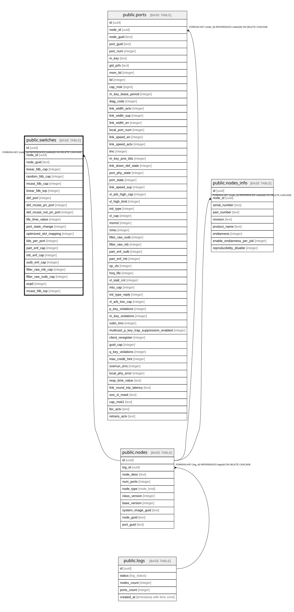

# public.switches

## Description

Таблица для хранения сущностей коммутаторов. Связана с nodes.

## Columns

| Name | Type | Default | Nullable | Children | Parents | Comment |
| ---- | ---- | ------- | -------- | -------- | ------- | ------- |
| id | uuid | uuid_generate_v4() | false |  |  |  |
| node_id | uuid |  | false |  | [public.nodes](public.nodes.md) |  |
| node_guid | text |  | false |  |  |  |
| linear_fdb_cap | integer |  | true |  |  | Лимит Linear FDB, может быть NULL если утилита вернула N/A |
| random_fdb_cap | integer |  | true |  |  |  |
| mcast_fdb_cap | integer |  | true |  |  |  |
| linear_fdb_top | integer |  | true |  |  |  |
| def_port | integer |  | true |  |  |  |
| def_mcast_pri_port | integer |  | true |  |  |  |
| def_mcast_not_pri_port | integer |  | true |  |  |  |
| life_time_value | integer |  | true |  |  |  |
| port_state_change | integer |  | true |  |  |  |
| optimized_slvl_mapping | integer |  | true |  |  |  |
| lids_per_port | integer |  | true |  |  |  |
| part_enf_cap | integer |  | true |  |  |  |
| inb_enf_cap | integer |  | true |  |  |  |
| outb_enf_cap | integer |  | true |  |  |  |
| filter_raw_inb_cap | integer |  | true |  |  |  |
| filter_raw_outb_cap | integer |  | true |  |  |  |
| enp0 | integer |  | true |  |  |  |
| mcast_fdb_top | integer |  | true |  |  |  |

## Constraints

| Name | Type | Definition |
| ---- | ---- | ---------- |
| switches_node_id_fkey | FOREIGN KEY | FOREIGN KEY (node_id) REFERENCES nodes(id) ON DELETE CASCADE |
| switches_pkey | PRIMARY KEY | PRIMARY KEY (id) |
| switches_node_id_key | UNIQUE | UNIQUE (node_id) |

## Indexes

| Name | Definition |
| ---- | ---------- |
| switches_pkey | CREATE UNIQUE INDEX switches_pkey ON public.switches USING btree (id) |
| switches_node_id_key | CREATE UNIQUE INDEX switches_node_id_key ON public.switches USING btree (node_id) |

## Relations

---

> Generated by [tbls](https://github.com/k1LoW/tbls)
